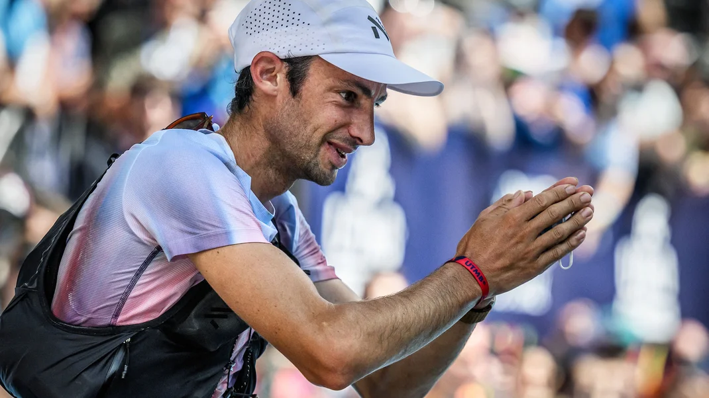
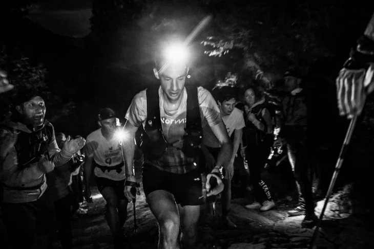
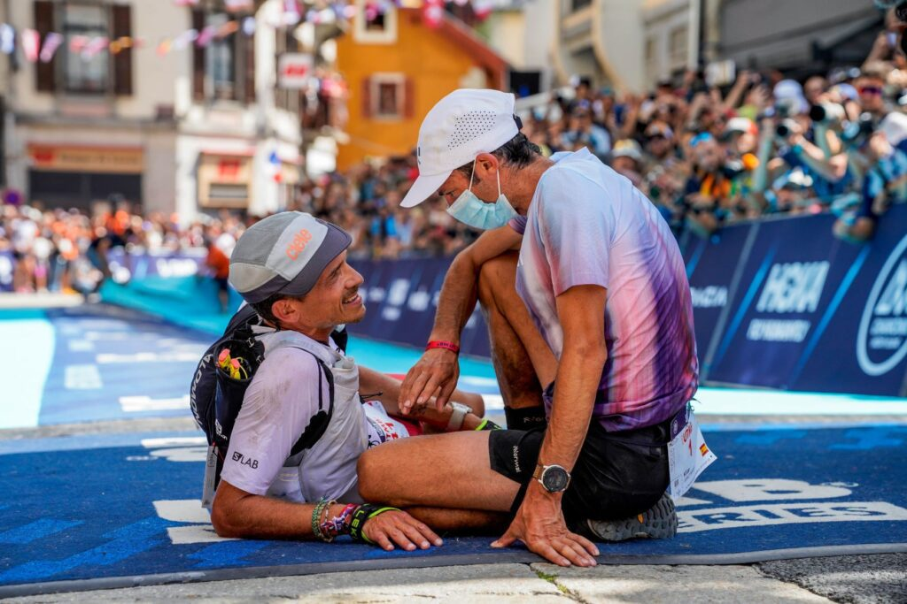
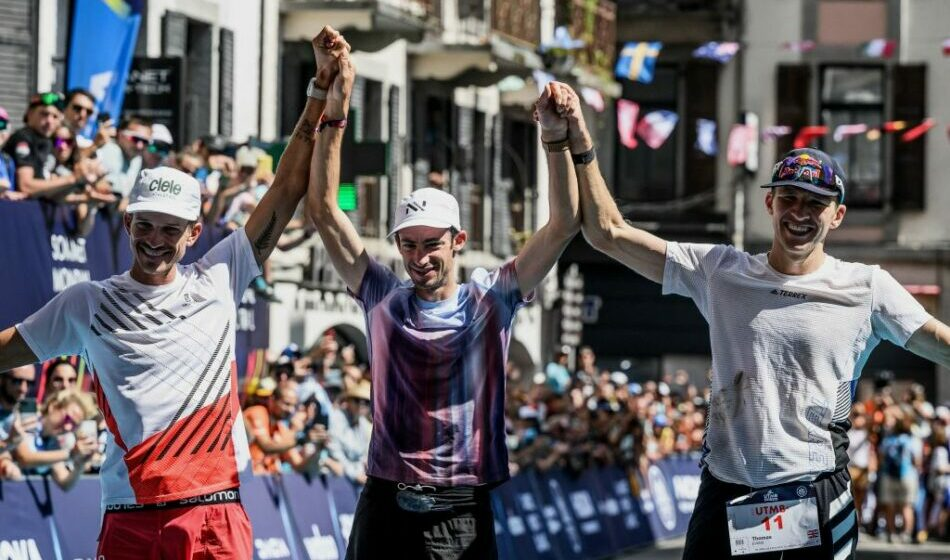

Traduction de l’article de David Roche dans [trailrunnermag](https://www.trailrunnermag.com/) disponible ici : [Eight Takeaways from Kilian Training Data](https://www.trailrunnermag.com/training/trail-tips-training/kilian-jornet-training-data/)  

[David Roche](https://www.trailrunnermag.com/byline/david-roche/) a plein d'articles intéressant sur [trailrunnermag](https://www.trailrunnermag.com/) !   
Ils ont aussi un podcast avec sa compagne : [Some Work, All Play](https://open.spotify.com/show/3AaJYZngimocFf8aztKTcO?si=e85b03120b1f4538). Ça digresse pas mal mais c'est intéressant :-)

Ils ont par exemple sur le même thème :
* [une interview de Kilian](https://open.spotify.com/episode/6b7YuYZ5cEZI5HMRHSqoi1?si=7e3c4fa9501b4d15) ;
* [un discussion autour de l'UTMB de Kilian](https://open.spotify.com/episode/4rcdLZ6z2d0ESWnvuDpMcs?si=ce03d22012e24b11).

---

# Huit points à retenir des données d'entraînement 2022 de Kilian Jornet  

Kilian Jornet vient de publier un résumé de ses données d'entraînement et de ses pratiques pour l'ensemble de 2022. Son article est destiné à être un guide légendaire pour réfléchir à la théorie de l'entraînement et à ce qu'il faut faire pour avoir la meilleure saison de tous les temps.  

La semaine dernière, j'ai écrit une [introduction sur les données d'entraînement de Kilian Jornet](https://www.trailrunnermag.com/training/trail-tips-training/3-takeaways-from-kilian-jornets-utmb-training-and-race-data/) entre ses records de parcours sur la Hardrock et à l'UTMB (données publiées par Coros (les données sont [là](https://coroscom.wpcomstaging.com/utmb/)).  

Après la parution de l'article, Kilian m'a envoyé un nouveau lien. Au cas où vous vous poseriez la question, mon top 3 : découvrir que j'allais être papa, mon mariage, Kilian qui se glisse dans mes DMs, dans l'ordre inverse d'importance.  

J'ai cliqué sur le lien et bam : Kilian a écrit un [article](https://mtnath.com/training2022/) qui sera un pilier fondamental de la théorie de l’entraînement, levant le voile sur ses données, sa théorie et son état d'esprit. C'est presque sans précédent dans l'histoire des sports d'endurance – un athlète au sommet de ses capacités étant totalement transparent sur le comment et le pourquoi de son succès.  

L'exemple le plus récent auquel je puisse penser est l'entraînement de Nils van der Poel pour le patinage de vitesse (dont je parle [ici](https://www.trailrunnermag.com/training/trail-tips-training/the-wildly-cool-training-approach-of-speed-skating-gold-medalist-nils-van-der-poel/), le document de Nils peut se trouver [ici](https://www.howtoskate.se/)).  

Mais je pense que Nils a écrit son document en sachant qu'il était peu probable que quiconque puisse répéter son modèle de périodisation.  

L'entraînement de Kilian, en revanche, est beaucoup plus classique, le type d'approche que presque n'importe quel athlète pourrait utiliser avec des modifications pour coller à ses antécédents. Le GOAT veut juste ajouter à l'ensemble des connaissances de l'entraînement d'endurance, où il est à la fois étudiant et enseignant.  

Le GOAT veut que nous soyons tous la version GOAT de nous-mêmes.  

[Lisez son article complet](https://mtnath.com/training2022/), c'est brillant et important.
Dans cet article, je vais fournir un contexte pour son entraînement, en insistant sur huit points qui sont pertinents pour tout le monde.

---

## L'année 2022 de Kilian était absolument stupéfiante.

Même en tant que fanboy ultime, je trouve époustouflant qu'un athlète soit le meilleur coureur de montagne courte distance (record du parcours à Zegama) *et* le meilleur coureur de montagne longue distance (record du parcours à l'UTMB) la même année. La réponse facile à sa domination est de dire qu'il est génétiquement au-dessus. Mais au très au niveau, c'est toujours une compétition entre des sportifs génétiquement exceptionnels, et les différences génétiques ne suffisent pas à elles seules à expliquer une domination comme celle de Kilian en 2022. En lisant son article, il est clair qu'il a gagné en 2022 avec une vision méthodique et centrée sur des processus de longue durée et une croissance à long terme à travers des décennies d'entraînement intensif.  

Sur notre [podcast](https://open.spotify.com/episode/6b7YuYZ5cEZI5HMRHSqoi1?si=ca9901ecb8bd4076), il a expliqué comment sa manière de s’entraîner avait fondamentalement évolué en 2018 et 2019, coïncidant avec la naissance de son premier enfant. Au lieu de longues journées en montagnes en zone 2, il s'est  tourné vers une distribution d'intensité différente, mettant l'accent sur un volume facile et des entraînements ciblés. Il a fait ces changements sans entraîneur (bien qu'il travaille avec le physiologiste de sport Jesús Álvarez-Herms) et s'est transformé en expert en physiologie de l'exercice et en théorie de l'entraînement, appliquant ce qu'il a appris et apportant des modifications en fonction de ce qui a fonctionné pour lui.  
  

Il est temps de s'y mettre ! Plongeons-nous dans 8 points à retenir d'un résumé d'entraînement qui façonnera le sport pour les années à venir.

---

# **Un** : L'entraînement est un processus à long terme ou la régularité et le développement aérobie sont primordiaux.

Un chiffre impressionnant est le volume d'entraînement hebdomadaire de Kilian depuis avril 2009. Bien qu'il y ait des écarts, la plupart des semaines font en moyenne environ 20 heures, réparties entre la course, le ski, le vélo et d'autres sports. Il y a de grandes hausses de skimo en hiver et de course à pied à partir du printemps, son entraînement suivant un cycle saisonnier.  

À l'extrême droite du graphique se trouve un cercle rouge microscopique englobant 2022. C'est une visualisation frappante de la façon dont notre cerveau peut penser à court terme, mais nos corps jouent sur des échelles de temps beaucoup plus longues.  

*« Il n'y a pas de séance magique qui vous rendra meilleur ou un programme d'entraînement qui fonctionnera pour tout le monde »*, dit-il. *« Mais les adaptations proviennent de la répétition des stimuli d'entraînement (régularité) et de l'individualisation de ces stimuli. »*  

Kilian a régulièrement effectué en moyenne plus de 1000 heures d'entraînement par an, principalement faciles, dans plusieurs sports. Ses racines aérobies sont profondes. Pour nous tous, le premier principe de l'entraînement d'endurance est d'accumuler un volume facile au fil du temps. La base de toutes les performances de 800 mètres à plus de 200 miles est la façon dont le système aérobie traite l'énergie et la fatigue associée. Cette capacité vient de la régularité d'un entraînement facile.  

---

# **Deux** : la plupart de ses entraînements sont très faciles, avec une distribution d'intensité pyramidale.

C'est maintenant le moment pour chaque athlète de prêter attention aux conseils spécifiques du GOAT. Vous entendez dire que la plupart des entraînements devraient être faciles, mais qu'est-ce que cela signifie réellement?  

Voici la répartition de l'intensité d'entraînement de Kilian à l'aide du modèle à 5 zones:
- 58% zone 1 (récupération active, respiration nasale)
- 19% zone 2 (endurance aérobie, peut se conserver des heures)
- 16% zone 3 (tempo, on peut dire plusieurs phrases)
- 4% zone 4 (rythme de course, on peut dire une phrase)
- 3% zone 5 (max)
  
58% en zone 1 ! C'est un nombre étonnant, faisant écho à l'évolution de la théorie de l'entraînement dans les sports d'endurance. Le volume facile ne permet pas seulement de récupérer des sessions difficiles, mais il fournit le carburant qui rend ces sessions difficiles possibles.

Sa distribution d'intensité est fortement pyramidale avec des notes de seuil, avec 77% de son entraînement dans la zone 1 et la zone 2. Les 16% dans la zone 3 et 4% dans la zone 4 représentent une quantité élevée de travail de seuil, similaire à certaines approches utilisées par les coureurs et triathlètes norvégiens. La plus petite quantité de travail de la zone 5 montre qu'il développe toujours sa vitesse de pointe, mais avec une moindre importance.  

Il est tentant d'aller sur les sentiers et de supposer que plus vite on va mieux c'est. Mais accumuler trop de travail de haute intensité fait que tout décline après une période initiale de croissance, car le système musculo-squelettique s'use, le système endocrinien est surchargé et le système aérobie s'érode avec un métabolisme lipidique et une fonction mitochondriale qui décline.  

Certes, 58% de l'entraînement dans la zone 1 est peut-être spécifique à Kilian, nécessitant une excellente efficacité aérobie et un volume très élevé. Sur notre podcast, il a parlé de se déplacer rapidement en montagne à une fréquence cardiaque de 110 à 120 battements par minute (ce qui est ma fréquence cardiaque lorsque je vais chercher à bouffer sur l'étagère du haut du garde-manger). Mais chaque athlète devrait probablement avoir une répartition plus égale entre la zone 1 et la zone 2, ces pourcentages totalisant environ 80 %. Tout l'entraînement facile n'est pas identique, et il est utile de ralentir certains jours pour améliore la qualité de l'entraînement, notre longévité et notre progression sur le long terme en explorant l’entièreté du spectre aérobie.
 
L'entraînement pyramidal est l'approche prédominante chez les athlètes élite (en tout cas ceux dont l'entraînement a fait l'objet d'études), ce qui signifie que la deuxième plus grande proportion d’intensité est le tempo/seuil, avec une portion beaucoup plus petite d’intensité ou l'on est plus rapide que la vitesse critique et la VO2 max.  

Kilian laisse place à la discussion. *« Je sais, par exemple, que je peux absorber une grande quantité de volume et d'entraînement Z2 et Z3, mais si je fais plus de travail de vitesse pendant plusieurs semaines continues (Z4 et Z5) Je vais me blesser ou avoir un métabolisme moins efficace »*, dit-il. *« Pour les autres athlètes, c'est le contraire. »*  

Ce qui est fascinant dans la recherche, c'est qu'une approche avec une proportion plus élevée de travail haute intensité dans les zones 4 et 5 (connue sous le nom d'entraînement polarisé) est très rarement utilisée à long terme en raison de sa tendance à provoquer des adaptations rapides, suivies d'une stagnation (voire de blessures).

---

# **Trois** : Kilian périodise son entraînement tout au long de l'année, avec une période de base aérobie précédant des blocs d'entraînement spécifiques.

L'hiver de Kilian se passe sur les skis, où il est un athlète de skimo de classe mondiale. De décembre à mars, il faisait 2 à 4 heures sur des skis (principalement dans la zone 2) le matin, suivis d'une course facile de 40 à 60 minutes sur tapis roulant l'après-midi. Ses graphiques d'entraînement ne montrent aucun entraînement difficile pendant tout ce temps. Fait intéressant, il a fait une course de 100 milles en février pour tester le ravitaillement. Même si je pense que l'approche de Kilian peut servir à tous, faire une course de 100 miles sur une période quasiment uniquement basée sur du ski est peut-être une chose que lui seul peut faire. C'est comme la [compression blanche à la Western States](https://s3.amazonaws.com/www.irunfar.com/wp-content/uploads/2021/06/16124928/Kilian-Jornet-2010-Western-States-1.jpg), c'est pas pour tout le monde.  

Cette période de base vient renforcer un système aérobie déjà monstrueux. Le fait qu'il n'ait pas fait que du ski révèle une leçon importante. Il peut être utile de renforcer les adaptations mécaniques en courant toute l'année, même si ce n'est pas l'objectif principal.  

À partir de mars, il s'est entraîné pour Zegama (la course étant fin mai), en mettant l'accent sur du gros volume (150-190 km / 93-118 miles par semaine) avec 2 entraînements de qualité. En juin et juillet avant la Hardrock 100, il a augmenté le volume  d'entraînement jusqu'à 200 km (124 miles) par semaine, mais n'a pas fait de séances plus longues et a continué à faire 2 entraînements de vitesse par semaine. De Hardrock à l'UTMB, il s'est principalement concentré sur la récupération et l'entretien ([découvrez cette période ici](https://www.trailrunnermag.com/training/trail-tips-training/3-takeaways-from-kilian-jornets-utmb-training-and-race-data/)).  

Renforcer une base aérobie tout au long de l'année est essentiel pour tous les athlètes d'endurance, et il peut être utile d'avoir un bloc de développement aérobie plus ciblé hors saison. Cet hiver en coaching, motivé par Kilian et Nils, je vais me concentrer davantage sur des [périodes de base aérobie dédiées](https://www.trailrunnermag.com/training/trail-tips-training/what-it-means-to-base-build-and-how-to-do-it/), en particulier pour les athlètes d'élite. Pour les athlètes qui n'ont pas l'expérience de  Kilian ni sa VO2 max, cela peut inclure une petite quantité d'intensité comme dans un modèle Lydiard classique, en mettant l'accent sur les adaptations mécaniques pour gérer un travail plus rapide (comme des exercices en côte (hill strides)).  

Kilian a gardé vision « aérobique-centrée » même lors de l'entraînement pour des courses courtes comme Zegama. Les avantages s'accumulent au fil du temps, alors continuez à empiler ces briques.  

---

# **Quatre** : La plupart de ses séances d'entraînement étaient relativement courtes, mais avec en doublant quasi quotidiennement.

Un grand changement dans la vie de Kilian a eu lieu lorsqu'il est devenu papa il y a quelques années. Son épouse Emelie Forsberg est elle-même l'une des GOAT, et ils équilibrent les exigences de la vie de famille, de leur travail et de l’entraînement en équipe. En pratique, cela signifie que l'un a le bloc du matin, l'autre le bloc de l'après-midi, puis leurs nuits sont libres une fois que les enfants se sont endormis.  

Et ce changement dans les exigences de sa vie a peut-être aussi révélé un secret d'entraînement : Kilian fait rarement de « longues » séances d'entraînement. Presque toutes ses sorties n'ont pas dépassé 4 heures en 2022 (la  plupart étant beaucoup plus courtes), un changement majeur par rapport à ce que j'avais entendu sur son entraînement au début des années 2010. Cependant, il a quand même accumulé un volume massif semaine après semaine. Comment arrive-t-il à ce résultat ?  

La réponse est en [doublant](https://www.trailrunnermag.com/training/trail-tips-training/the-performance-enhancing-power-of-easy-doubles/) – deux sessions en une journée. Sur notre podcast, il a déclaré qu'il doublait presque tous les jours. Pour tous les athlètes, doubler peut améliorer la réponse hormonale à l'entraînement, et éviter des séances trop longues pourrait également réduire une partie du stress chronique de l'entraînement à haut volume. Ces séances peuvent probablement être aussi courtes que 10 à 15 minutes, en course ou en entraînement croisé, et peuvent avoir une influence démesurée sur la croissance de la condition physique. Il y a une raison pour laquelle presque tous les journaux d'entraînement des athlètes d'élite demandent de doubler, même si nous ne sommes pas sûrs à 100 % du mécanisme d'action qui rend ce principe presque universels.  

La question en suspens est de savoir si d'autres athlètes d'ultra distance pourraient exceller avec si peu d'efforts extra-longs à l'entraînement. Kilian a effectué tellement d'ultra et de longues séances qu'il n'a aucun doute sur ses capacités aérobies ou sur la façon dont son corps réagira à la fin des courses. La plupart d'entre nous entrons dans l'inconnu, mais rien n'est inconnu pour Kilian. Fait intéressant, cette approche axée sur la fréquence d'entraînement pour accumuler du volume plutôt que sur des journées surdimensionnées se retrouve également dans une partie de l'entraînement de la championne d'ultra Camille Herron (et d'autres), il est donc possible que de très longs efforts soient une partie surestimée de l'entraînement ultra.  

---

# **Cinq** : Kilian fait des entraînements qui se concentrent sur les exigences spécifiques de ses événements.

Il est maintenant temps de faire du workout-porn. Je sais que Kilian ne veut pas que nous lisions trop profondément dans une session spécifique, mais celles-ci sont trop bonnes pour les laisser passer. Il regroupe ses séances en 3 groupes : *vitesse*, *seuil* et *tempo*.  

Pour un entraînement de vitesse à plat exclusivement, il n'a fait que 4 séances d'entraînement tout au long de l'année. WOW! Cela inclut des séances de piste de base comme 10 x 400 mètres, qu'il dit avoir limitées en raison du risque de blessure, un problème auquel il a été confronté dans le passé lorsqu'il se concentrait sur l'entraînement sur route. C'est peut-être un endroit où sa capacité génétique compte - il est très rapide naturellement, donc ce n'est peut-être pas un élément qu'il a besoin de renforcer énormément, du moins sur un terrain plat. La plupart des coureurs de trail peuvent probablement limiter leur travail sur terrain plat, avec juste assez de renforcement pour traduire leur force en pente en vitesse à plat.  

Sa séance de base était une séance d'entraînement combinée montée / plate ([comme ce que j'ai écrit ici](https://www.trailrunnermag.com/training/trail-tips-training/the-endurance-building-power-of-tempo-run-combination-workouts/)). Il commence par 1 ou 2 intervalles dans une montée raide, avec la descente pour la récupération. Après, il fait un entraînement plat, comme un tempo de 10 km, un tempo de 2 x 5 km ou 10 x 1 km. Sur le podcast, il a déclaré que cela améliorait sa capacité à courir rapidement en montée, puis sur des plats rapides, comme dans une course. Tous les athlètes peuvent probablement utiliser des entraînements combinés, mais adapté à leur niveau.  

Son troisième grand type de session était une course soutenue plus longue. Il commence en zone 2 élevée avant d'augmenter l'effort, généralement sur 20 km à 30 km (12 – 18 miles). Ces courses longues et soutenues sont probablement sous-utilisées par de nombreux athlètes à l'entraînement, et elles constituent une excellente occasion de développer une endurance spécifique et une résilience musculo-squelettique. Veillez simplement à ne pas les transformer en courses, car le  contrôle de l'intensité est essentiel pour éviter de passer trop de temps dans les zones d'intensité supérieure, ce qui saperait la croissance aérobie.  

La simplicité magique de l'entraînement de Kilian est qu'il s'agit en général de 2 de ces entraînements par semaine, plus une base aérobie avec des doubles séances faciles. On répète ça chaque semaine, avec un ajout de spécificité avant les courses : un volume plus élevé précédant les longs ultras ou une plus grande concentration sur les entraînements typés *vitesse* ou *tempo* avant les événements plus courts. Terminez par un tapering très tranquille et comprenant des jours de repos pour les ultras, et un peu moins tranquille avec moins de jours de repos pour les courses plus courtes.  

---

# **Six** : La majeure partie de son entraînement aérobique se déroule sur des sentiers escarpés et techniques.

Alors que Kilian fait régulièrement des entraînements modérés / durs sur des terrains plats ou des sentiers non techniques, bon nombre de ses courses faciles se déroulent sur les sentiers où il vit en Norvège. Le simple fait de regarder une photo de ces sentiers me donne un ulcère de stress - ils sont raides et techniques d'une manière rarement vue aux États-Unis en dehors des voies d'escalade.  

Il aime que les entraînements se déroulent sur des surfaces plus lisses et/ou plus plates pour *« privilégier les capacités métaboliques et musculaires »*. Il aime les journées plus lentes *« sur un terrain qui défie d'autres aspects (cognitif, mental, technique, visualisation... et c'est beaucoup plus amusant !). »*  

Assurez-vous que vous ne sacrifiez pas votre efficacité / rendement dans vos sessions les plus difficiles. Dans une montée raide et technique, le rythme d'un athlète ajusté à la pente peut être de 1 à 2 minutes par mile plus lent que dans une montée moins technique. Bien que les efforts soient tout aussi difficiles, cela se traduit par un rendement / efficacité plus faible et probablement par moins d'adaptations. Cependant, les jours purement faciles, vous pouvez vous amuser avec les terrains techniques ! De plus, travailler les capacités techniques nécessite une concentration constante, comme tous les mouvements physiques exigeants sur le plan cognitif et neuromusculaire.  

---

# **Sept** : Le travail de force ne fait pas partie de son entraînement.

Je sais que vous savez que je ne suis pas un grand fan d'un trop grand focus sur le renforcement musculaire. Mais mon point de vue est largement dépassé par celui de Kilian. *« Je ne fais pas de séances de musculation »*, dit-il. *« Ayant peu de temps  pour l'entraînement, je pense que le stress causé au corps par le renforcement musculaire serait trop important pour pouvoir donner le meilleur lors des séances de course à pied ou de ski, et c'est sur ces dernières que je veux mettre l'accent car elles sont plus spécifiques. »*  

Cependant, il est important de noter que le ski est un peu comme une longue séance de musculation, et la façon dont Kilian effectue ces séances de côtes est similaire à la pliométrie. Il peut donc jouer avec des règles différentes que celles de la plupart des athlètes. J'aime un [programme à dose minimale](https://www.trailrunnermag.com/training/trail-tips-training/minimal-dose-resistance-training/), axé sur le moins possible pour obtenir les adaptations nécessaires, [à peine quelques minutes](https://www.trailrunnermag.com/trainingtrail-tips-training/the-busy-runners-weekly-strength-and-mobility-plan/) 2 à 3 fois par semaine.

---

# **Huit** : C'est le process qui est important.

Vers la fin de notre podcast, nous avons demandé à Kilian quel conseil il donnerait à un jeune pro. Nous avions plongé profondément dans la théorie de l’entraînement, alors j'essayais de lui poser une question pour qu'il révèle son secret méthodologique ultime. Au lieu de cela, il a détourné quelque peu la conversation.  

*« Concentrez-vous sur le processus, pas sur les résultats. »*  

Il a décrit l'importance de développer un amour profond de l'entraînement quotidien, à travers des hauts et des bas, des victoires et des défaites. Il va falloir de nombreuses années pour voir où sont nos limites, et c'est bien mieux quand c'est amusant.  

Au cours des dernières semaines, j'ai appris que Kilian n'était pas le GOAT à cause de la génétique. Il est le GOAT parce qu'il l'aime ce sport. Nous lui avons demandé comment il concilie l'amour de la montagne avec toutes les données qu'il collecte sur ses entraînements. Il a eu une réponse de génie : pour lui, la science est une manifestation de son amour, de son respect pour le sport et la montagne et ce qu'elle exige.  

Je n'ai jamais été aussi motivé pour sortir demain et courir. Je le ferai par amour du processus. J'espère que vous êtes aussi inspiré par Kilian que moi, et que ça vous aidera à sortir demain et à aimer ce processus désordonné.
Et j'espère que nous pourrons tous faire cela toute l'année pendant quelques décennies pour trouver nos vraies limites… avec une partie substantielle de ces jours dans la zone 1.